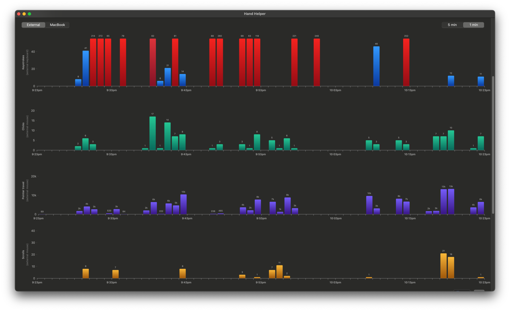
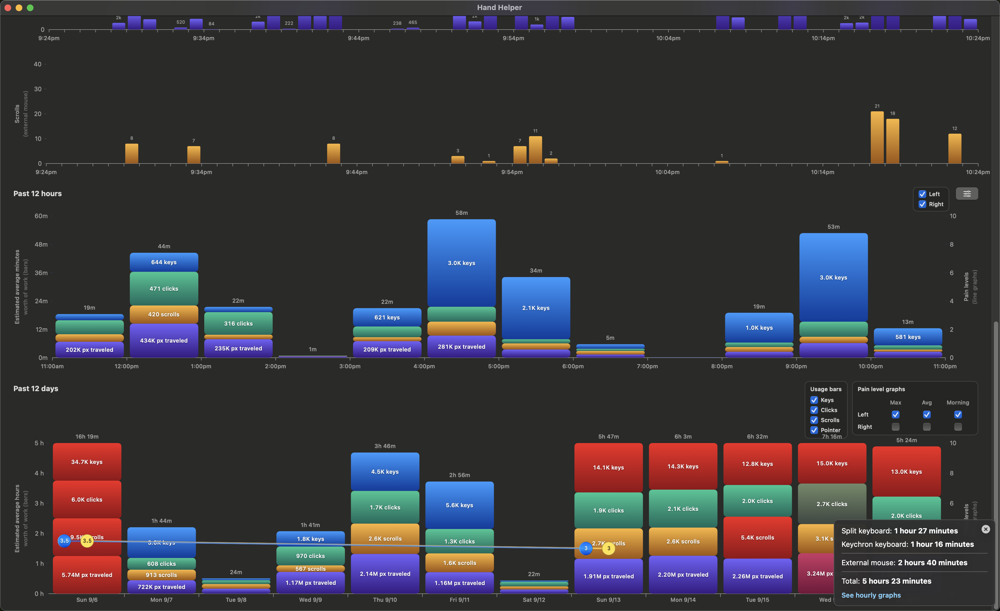
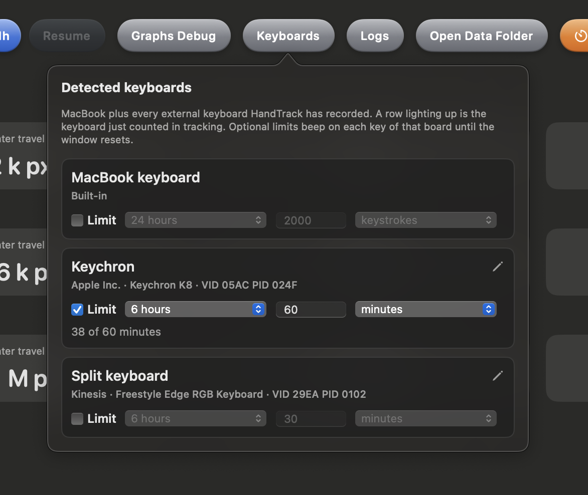
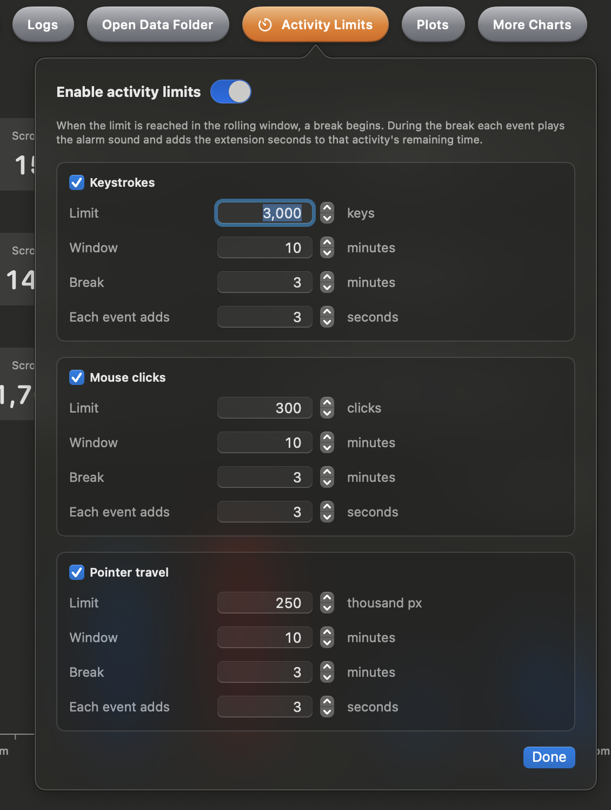

# Hand Helper (HandTrack)

**Outward-facing product name:** Hand Helper

**Internal / codebase name:** HandTrack (original name). Xcode project, targets, Swift packages, bundle identifiers, and the on-disk support folder `Application Support/HandTrack` still use this name on purpose so signing, permissions, and migrations stay stable.

Hand Helper is an MVP for tracking hand symptoms and keyboard activity across an iPhone and a Mac without cloud storage.

## Screenshots (macOS)

### Live activity graphs

Minute-level keystrokes, clicks, pointer travel, and scrolls (external devices shown here).



### Hourly and daily graphs

Past 12 hours and past 12 days of estimated workload with optional pain overlays.



### Keyboard limits

Per-keyboard optional limits that beep while a board is over its windowed budget.



### Activity limits

Rolling-window break alarms for keystrokes, mouse clicks, and pointer travel.



## MVP

- iOS app: hourly reminders and current-hour pain/use/journal logging.
- macOS app: keystroke capture while the app is open (aggregated per minute in SQLite).
- Mac storage: local SQLite in Application Support.
- Local sync: the Mac exposes a Wi-Fi endpoint and the iPhone can send saved hourly logs.

## Build

Generate the Xcode project:

```sh
xcodegen generate
```

Then open `HandTrack.xcodeproj` and run either `HandTrackiOS` or `HandTrackMac`.

The macOS target needs Input Monitoring permission for global keystroke capture.
